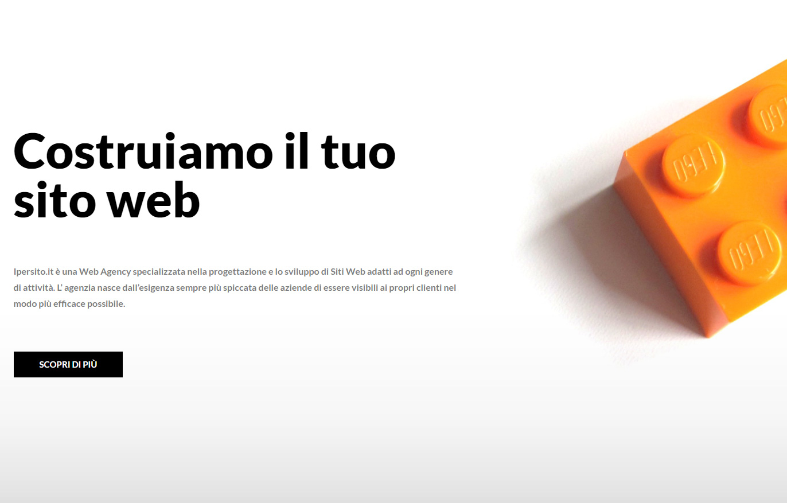

  <h1 align="center">
    Ipersito.it
  </h1>
  <h3 align="center">
      
    <br>
  <br>
    <a href="https://www.ipersito.it/">Live Preview</a>
  </h3>

## The Project
Ipersito.it is the site of my new web agency. A presentation of my works, my experiences and my interests.
<br>
<br>
I created the site with wordpress and the page builder elementor to give a modern design to the pages. 
<br>
<br>
On github I exported the static pages of the site in html generated with the plugin Simply Static to not load all the wordpress folders.

## Built With

* ```WORDPRESS```
* ```ELEMENTOR```
